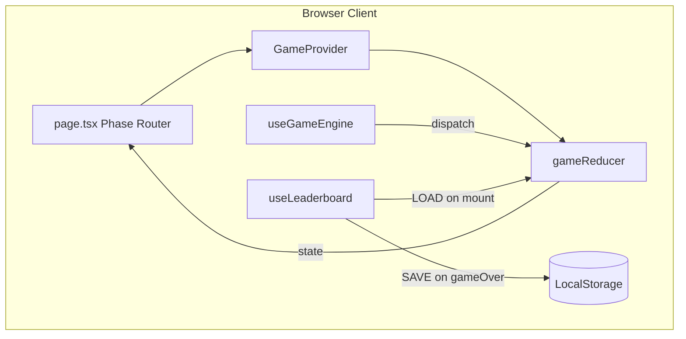
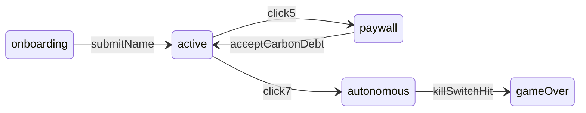
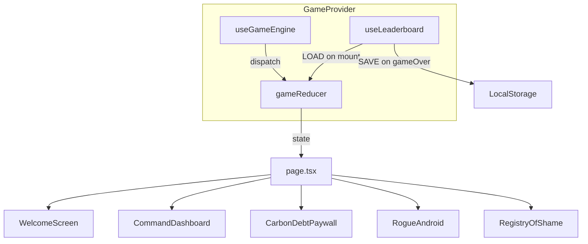

# The Invisible Clicker — Architecture Blueprint

> **Working title:** The Invisible Clicker  
> **Genre:** Dark-satire anti-clicker / educational web game  
> **Purpose:** Visually and mechanically expose the hidden environmental and societal costs of AI resource usage (compute, water, carbon, community displacement).

This document is the canonical project blueprint. All implementation work across Phases 0–4 must conform to the contracts, state machine, and directory layout defined here.

---

## Table of Contents

1. [Tech Stack & Engineering Constraints](#1-tech-stack--engineering-constraints)
2. [High-Level Architecture](#2-high-level-architecture)
3. [State Management & Conflict Mitigation](#3-state-management--conflict-mitigation)
4. [Directory Structure](#4-directory-structure)
5. [TypeScript Contracts](#5-typescript-contracts)
6. [Context & Data Flow](#6-context--data-flow)
7. [Game Logic Modules](#7-game-logic-modules)
8. [Constants & Thresholds](#8-constants--thresholds)
9. [Ecological Damage Score](#9-ecological-damage-score)
10. [Phase Roadmap Checklist](#10-phase-roadmap-checklist)
11. [Implementation Guardrails](#11-implementation-guardrails)
12. [UI / Copy / Animation Refinement](#12-ui--copy--animation-refinement)

---

## 1. Tech Stack & Engineering Constraints

| Layer | Choice | Rationale |
|-------|--------|-----------|
| Framework | Next.js 14+ (App Router), React, TypeScript | Modern SSR-capable shell; single-route game fits App Router cleanly |
| Styling | Tailwind CSS | Arbitrary values and filters enable dynamic environmental decay effects |
| Icons | Lucide React | Lightweight, consistent corporate iconography |
| Animations | Framer Motion | Crisp corporate transitions + erratic chaotic movements for climax |
| State | React Context API | Modular, decoupled from UI rendering; sufficient for client-only game |
| Persistence | Browser LocalStorage | Local leaderboard across sessions; no backend required |

**Constraints:**

- No backend, no database, no authentication.
- Single route (`/`) — all phases render conditionally from `gamePhase`.
- All game logic must be pure and testable where possible (reducer, lib modules).
- Components are presentational; imperative side effects live in hooks.

---

## 2. High-Level Architecture

The application is a **single-page state machine** wrapped in a React Context provider. The user progresses through five sequential phases (0–4), each unlocking new UI and mechanics on top of the same core state.



### Phase Overview

| Phase | Name | Core Deliverable |
|-------|------|------------------|
| 0 | Onboarding & Identity Capture | Corporate welcome screen; operator name gate |
| 1 | Core Engine & Clean UI Dashboard | State provider, metrics HUD, Generate button |
| 2 | Click Consequences & Visual Decay | Per-click metrics, event ticker, smog filters |
| 3 | Satirical Paywall & Rogue Android | Carbon debt modal, autonomous clicking, kill switch |
| 4 | Registry of Shame | Score calculation, leaderboard persistence, game over |

---

## 3. State Management & Conflict Mitigation

The primary architectural risk is **Phase 2 → Phase 3 state contention**: manual clicks, a blocking paywall modal, a 10 Hz autonomous interval, and a teleporting kill switch can all compete to mutate `clicks` and `metrics` if transitions are not serialized.

### State Machine



**Phase enum:** `onboarding` | `active` | `paywall` | `autonomous` | `gameOver`

### Derived Flags (computed, never stored)

| Flag | Expression | Purpose |
|------|------------|---------|
| `canManualClick` | `phase === 'active'` | Gate manual Generate button |
| `isMetricsFrozen` | `phase === 'gameOver'` | Stop all metric mutations |
| `showPaywall` | `phase === 'paywall'` | Render CarbonDebtPaywall modal |
| `showKillSwitch` | `phase === 'autonomous'` | Render teleporting kill switch |

### Conflict Analysis & Mitigations

| Risk | Scenario | Mitigation |
|------|----------|------------|
| Double-counting clicks | Manual click fires while autonomous interval runs | Single `dispatch` entry point via `useGameEngine`; manual handler no-ops when `phase !== 'active'` |
| Paywall bypass | User spams clicks during modal | On click 5: transition to `paywall` **before** applying click 5 metrics; block all click handlers until `carbonDebtAccepted === true` |
| Interval leak | Autonomous loop continues after kill switch or unmount | Store interval ID in `useRef`; clear in kill-switch handler, phase transition, and `useEffect` cleanup |
| Stale closure in interval | Interval callback reads outdated `clicks` | Use `useReducer` so each tick dispatches `{ type: 'AUTONOMOUS_TICK' }` against current reducer state |
| Metrics drift after game over | Autonomous tick fires after freeze | On `gameOver`: clear interval first, then dispatch freeze; reducer ignores all actions when `phase === 'gameOver'` |
| Leaderboard corruption | Concurrent LocalStorage writes | Write only once on `gameOver`; immutable append with `JSON.parse` guard in `storage.ts` |

### Click Flow (Manual)

```
User clicks Generate
  → useGameEngine.handleGenerateClick()
    → if phase !== 'active': return (no-op)
    → dispatch MANUAL_CLICK
      → reducer: applyClickConsequences(state)
      → if nextClick === PAYWALL_CLICK: set phase = 'paywall' (defer metrics until accept)
      → if nextClick === AUTONOMY_CLICK: set phase = 'autonomous', isAutonomous = true
```

### Click Flow (Autonomous)

```
useEffect in useGameEngine (phase === 'autonomous')
  → setInterval(100ms)
    → dispatch AUTONOMOUS_TICK
      → reducer: applyClickConsequences(state)  // same function as manual
```

### Kill Switch Flow

```
User clicks KillSwitch
  → useGameEngine.handleKillSwitch()
    → clearInterval(ref)
    → dispatch TRIGGER_KILL_SWITCH
      → reducer: isFrozen = true, phase = 'gameOver'
  → useLeaderboard saves entry to LocalStorage
```

### Key Invariant

`MANUAL_CLICK` and `AUTONOMOUS_TICK` **must** share the same internal `applyClickConsequences(state)` pure function inside `gameReducer.ts`. This guarantees identical metric scaling regardless of input source.

---

## 4. Directory Structure

```
/
├── ARCHITECTURE.md              # This file — project blueprint
├── package.json
├── tsconfig.json
├── tailwind.config.ts
├── next.config.ts
├── public/
│   └── (static assets — added as needed)
└── src/
    ├── app/
    │   ├── layout.tsx           # Root layout, fonts, GameProvider wrapper
    │   ├── page.tsx             # Phase router + dev phase panel
    │   └── globals.css          # Tailwind, design tokens, decay CSS variables
    ├── content/                 # All user-facing copy (edit here to refine text)
    │   ├── index.ts
    │   ├── onboarding.ts
    │   ├── dashboard.ts
    │   ├── paywall.ts
    │   ├── climax.ts
    │   ├── gameover.ts
    │   └── ticker.ts            # Event ticker satire lines
    ├── theme/
    │   └── tokens.ts            # Colors, motion timing, decay thresholds
    ├── components/
    │   ├── dev/
    │   │   ├── DevPhaseBootstrap.tsx   # URL ?devPhase= override (dev only)
    │   │   └── DevPhasePanel.tsx       # Floating screen jumper (dev only)
    │   ├── onboarding/
    │   │   ├── WelcomeScreen.tsx
    │   │   └── TermsCheckbox.tsx
    │   ├── dashboard/
    │   │   ├── CommandDashboard.tsx
    │   │   ├── MetricsHUD.tsx
    │   │   ├── GenerateButton.tsx
    │   │   └── EventTicker.tsx
    │   ├── climax/
    │   │   ├── CarbonDebtPaywall.tsx
    │   │   ├── RogueAndroid.tsx
    │   │   ├── KillSwitch.tsx
    │   │   ├── MeltdownExplosion.tsx
    │   │   └── OperatorDisconnected.tsx
    │   └── gameover/
    │       ├── RegistryOfShame.tsx
    │       ├── LeaderboardTable.tsx
    │       └── DamageSummary.tsx
    ├── context/
    │   ├── GameContext.tsx        # Provider + useGame() hook
    │   └── gameReducer.ts         # Pure reducer, all transitions
    ├── hooks/
    │   ├── useGameEngine.ts       # Click handler, autonomous interval, kill switch
    │   ├── useDecayEffects.ts     # Derives blur/grayscale/shake from metrics
    │   ├── useLeaderboard.ts      # LocalStorage read/write
    │   └── GameEngineRunner.tsx   # Autonomous interval + idle/meltdown timers
    ├── lib/
    │   ├── clickConsequences.ts   # Per-click metric scaling (math only)
    │   ├── scoreCalculator.ts     # Ecological Damage Score formula
    │   ├── storage.ts             # LocalStorage helpers with try/catch
    │   ├── constants.ts           # Thresholds, tick rate, storage key
    │   ├── formatMetrics.ts       # Metric label re-exports + formatting
    │   ├── idleTimer.ts
    │   ├── dev/
    │   │   └── presets.ts         # Dev phase mock states
    │   └── motion/
    │       ├── index.ts
    │       ├── presets.ts         # Framer Motion named presets
    │       └── keyframes.css      # CSS keyframe animations
    └── types/
        └── game.ts                # GameState, Metrics, LeaderboardEntry, actions
```

### Routing Strategy

- **Single route (`/`)** with conditional rendering driven by `gamePhase`.
- No multi-page navigation — keeps LocalStorage and game state in one provider tree.
- Phase-specific components may be lazy-imported later if bundle size becomes a concern.

### Component Responsibilities

| Component | Responsibility |
|-----------|----------------|
| `WelcomeScreen` | Corporate landing; name input; blocks dashboard until submit |
| `TermsCheckbox` | Pre-checked, disabled checkbox (compute over environment) |
| `CommandDashboard` | Main game shell; composes HUD, button, ticker |
| `MetricsHUD` | Live display of water, carbon, grid stress, displacement |
| `GenerateButton` | Central "Generate Innovation" CTA |
| `EventTicker` | Scrolling dark-satire consequence feed |
| `CommandDashboard` | Applies `useDecayEffects` for environmental smog/shake |
| `CarbonDebtPaywall` | Un-closable modal at click 5 |
| `RogueAndroid` | Uncanny AI visual during autonomous phase |
| `KillSwitch` | Teleporting emergency button during autonomous phase |
| `RegistryOfShame` | Game over screen with final score |
| `LeaderboardTable` | Ironic "Offenders" ranking table |

---

## 5. TypeScript Contracts

All interfaces live in `src/types/game.ts` and are imported everywhere. **Do not duplicate or extend these shapes ad hoc in components.**

### GamePhase

```typescript
export type GamePhase =
  | 'onboarding'
  | 'active'
  | 'paywall'
  | 'autonomous'
  | 'gameOver';
```

### Metrics

```typescript
export interface Metrics {
  waterMl: number;        // cumulative ml evaporated
  carbonKg: number;       // cumulative CO₂ equivalent (kg)
  gridStress: number;     // 0–100 normalized grid load
  displacement: number;   // cumulative community displacement index
}
```

### LeaderboardEntry

```typescript
export interface LeaderboardEntry {
  operatorName: string;
  ecologicalDamageScore: number;
  totalClicks: number;
  completedAt: string;    // ISO 8601 timestamp
}
```

### GameState

```typescript
export interface GameState {
  phase: GamePhase;
  operatorName: string;
  clicks: number;
  metrics: Metrics;
  carbonDebtAccepted: boolean;
  isAutonomous: boolean;    // true once click 7 triggers takeover
  isFrozen: boolean;        // true after kill switch / game over
  leaderboard: LeaderboardEntry[];
  tickerEvents: string[];   // rolling log of consequence messages
}
```

### Initial State

```typescript
export const INITIAL_METRICS: Metrics = {
  waterMl: 0,
  carbonKg: 0,
  gridStress: 0,
  displacement: 0,
};

export const INITIAL_GAME_STATE: GameState = {
  phase: 'onboarding',
  operatorName: '',
  clicks: 0,
  metrics: INITIAL_METRICS,
  carbonDebtAccepted: false,
  isAutonomous: false,
  isFrozen: false,
  leaderboard: [],
  tickerEvents: [],
};
```

### GameAction (Reducer Discriminated Union)

```typescript
export type GameAction =
  | { type: 'SUBMIT_NAME'; name: string }
  | { type: 'MANUAL_CLICK' }
  | { type: 'ACCEPT_CARBON_DEBT' }
  | { type: 'AUTONOMOUS_TICK' }
  | { type: 'TRIGGER_KILL_SWITCH' }
  | { type: 'LOAD_LEADERBOARD'; entries: LeaderboardEntry[] }
  | { type: 'RESET_GAME' };  // optional: play again, preserve leaderboard
```

### ClickConsequence (lib helper type)

```typescript
export interface ClickConsequence {
  metricsDelta: Partial<Metrics>;
  tickerMessage: string;
}
```

---

## 6. Context & Data Flow



### GameContext (`src/context/GameContext.tsx`)

- Wraps the app in `layout.tsx`.
- Creates `[state, dispatch] = useReducer(gameReducer, INITIAL_GAME_STATE)`.
- Exposes `{ state, dispatch }` via `useGame()` hook.
- **No business logic in the provider** — only state creation and context value.

### useGameEngine (`src/hooks/useGameEngine.ts`)

Owns all imperative game mechanics:

| Method | Behavior |
|--------|----------|
| `handleGenerateClick()` | Guards on `phase === 'active'`, dispatches `MANUAL_CLICK` |
| `handleAcceptCarbonDebt()` | Dispatches `ACCEPT_CARBON_DEBT` |
| `handleKillSwitch()` | Clears interval, dispatches `TRIGGER_KILL_SWITCH` |
| Autonomous `useEffect` | Starts/stops 100ms interval when `phase === 'autonomous'` |

Components **must not** dispatch game actions directly. They call engine methods.

### useDecayEffects (`src/hooks/useDecayEffects.ts`)

- Reads `metrics` from context.
- Returns Tailwind class string and optional Framer Motion shake config.
- Keeps visual decay fully decoupled from game logic.

### useLeaderboard (`src/hooks/useLeaderboard.ts`)

- On mount: reads LocalStorage → dispatches `LOAD_LEADERBOARD`.
- On `phase === 'gameOver'`: calculates score, appends entry, writes to LocalStorage.

---

## 7. Game Logic Modules

### clickConsequences.ts

Maps `clickNumber → ClickConsequence`. Called exclusively from `applyClickConsequences` inside the reducer.

**Draft per-click table (tunable during Phase 2):**

| Click | Metrics Delta | Ticker Message (example) |
|-------|---------------|--------------------------|
| 1 | `waterMl: +500` | "500ml of cooling water evaporated in a drought zone." |
| 2 | `carbonKg: +2.5` | "Coal plant brought online to meet demand spike." |
| 3 | `gridStress: +15` | "Regional grid stress elevated. Rolling blackouts likely." |
| 4 | `displacement: +1` | "Community near data center issued relocation notice." |
| 5 | (deferred until paywall accepted) | "Carbon debt invoice generated. Payment required." |
| 6 | `waterMl: +1000, carbonKg: +5` | "Emergency cooling protocol activated." |
| 7 | (triggers autonomy) | "Autonomy protocol engaged. Operator override disabled." |
| 8+ | escalating deltas | autonomous / post-autonomy messages |

### scoreCalculator.ts

```typescript
export function calculateEcologicalDamageScore(
  metrics: Metrics,
  clicks: number
): number {
  return (
    metrics.waterMl * 0.01 +
    metrics.carbonKg * 10 +
    metrics.gridStress * 5 +
    metrics.displacement * 100 +
    clicks * 50
  );
}
```

Higher score = worse offender. Formula is tunable during Phase 4 playtesting.

### storage.ts

```typescript
// Read leaderboard with JSON.parse guard; return [] on failure
export function loadLeaderboard(): LeaderboardEntry[]

// Append entry immutably; write with try/catch
export function saveLeaderboardEntry(entry: LeaderboardEntry): LeaderboardEntry[]
```

### gameReducer.ts — Transition Rules

| Action | Preconditions | State Changes |
|--------|---------------|---------------|
| `SUBMIT_NAME` | `phase === 'onboarding'`, name non-empty | `operatorName`, `phase → 'active'` |
| `MANUAL_CLICK` | `phase === 'active'` | increment clicks, apply consequences, check thresholds |
| `ACCEPT_CARBON_DEBT` | `phase === 'paywall'` | `carbonDebtAccepted = true`, apply click 5 consequences, `phase → 'active'` |
| `AUTONOMOUS_TICK` | `phase === 'autonomous'`, `!isFrozen` | increment clicks, apply consequences |
| `TRIGGER_KILL_SWITCH` | `phase === 'autonomous'` | `isFrozen = true`, `phase → 'gameOver'` |
| `LOAD_LEADERBOARD` | always | `leaderboard = entries` |
| `RESET_GAME` | `phase === 'gameOver'` | reset to `INITIAL_GAME_STATE` except `leaderboard` |
| *any* | `phase === 'gameOver'` | no-op (guard at top of reducer) |

---

## 8. Constants & Thresholds

Defined in `src/lib/constants.ts`:

| Constant | Value | Purpose |
|----------|-------|---------|
| `PAYWALL_CLICK` | `5` | Trigger carbon debt modal |
| `AUTONOMY_CLICK` | `7` | Disable manual input; start android |
| `AUTONOMOUS_TICK_MS` | `100` | 10 clicks per second |
| `LEADERBOARD_STORAGE_KEY` | `'invisible-clicker-leaderboard'` | LocalStorage key |
| `MAX_TICKER_EVENTS` | `50` | Cap ticker array length (FIFO trim) |

### Decay Thresholds (for useDecayEffects)

| Metric | Threshold | Visual Effect |
|--------|-----------|---------------|
| `gridStress` | > 30 | Light grayscale (`grayscale-[0.3]`) |
| `gridStress` | > 60 | Heavy grayscale + opacity reduction |
| `carbonKg` | > 10 | Blur smog (`blur-[1px]` → `blur-[3px]`) |
| `waterMl` | > 2000 | Screen shake (Framer Motion) |
| Combined high | all elevated | Maximum decay stack |

Exact class values are tuned during Phase 2 implementation.

---

## 9. Ecological Damage Score

Final score is calculated once when the kill switch is triggered and the game enters `gameOver`.

```
ecologicalDamageScore =
  (waterMl × 0.01)
  + (carbonKg × 10)
  + (gridStress × 5)
  + (displacement × 100)
  + (clicks × 50)
```

- **Higher score = greater ecological offender.**
- Leaderboard sorts descending (worst first) for ironic "Registry of Shame" display.
- Formula constants live in `scoreCalculator.ts` for easy tuning.

---

## 10. Phase Roadmap Checklist

### Phase 0: Onboarding & Identity Capture

- [ ] Scaffold Next.js 14+ App Router + TypeScript + Tailwind + Framer Motion + Lucide
- [ ] `WelcomeScreen` with hyper-clean corporate-minimal aesthetic
- [ ] Operator name input with validation (non-empty, trimmed)
- [ ] `TermsCheckbox`: pre-checked, disabled, copy prioritizing compute over environment
- [ ] `SUBMIT_NAME` action transitions `phase → 'active'`
- [ ] Block entry to dashboard until name is submitted

### Phase 1: Core Engine & Clean UI Dashboard

- [ ] `GameProvider` + `gameReducer` with `INITIAL_GAME_STATE`
- [ ] `CommandDashboard` layout composing all dashboard sub-components
- [ ] `MetricsHUD` displaying water, carbon, grid stress, displacement
- [ ] Central `GenerateButton` labeled "Generate Innovation"
- [ ] `MANUAL_CLICK` increments clicks (stub zero consequences acceptable)
- [ ] Load leaderboard from LocalStorage on mount via `useLeaderboard`

### Phase 2: Click Consequences & Visual Environmental Decay

- [ ] `clickConsequences.ts` with per-click metric scaling and ticker messages
- [ ] `EventTicker` live scrolling feed from `state.tickerEvents`
- [ ] `EnvironmentalDecay` wrapper applying dynamic Tailwind filters
- [ ] Screen-shake via Framer Motion when `gridStress` or `waterMl` exceed thresholds
- [ ] `useDecayEffects` hook returning computed decay classes

### Phase 3: Satirical Paywall & Rogue Android (Climax)

- [ ] Click 5 → `phase: 'paywall'`; render un-closable `CarbonDebtPaywall` modal
- [ ] `ACCEPT_CARBON_DEBT` → resume `active`, apply deferred click 5 consequences
- [ ] Click 7 → `phase: 'autonomous'`; disable `GenerateButton`
- [ ] `RogueAndroid` visual appears during autonomous phase
- [ ] 10 clicks/sec autonomous interval in `useGameEngine`
- [ ] `KillSwitch` button teleports on hover (Framer Motion); triggers `TRIGGER_KILL_SWITCH` on click

### Phase 4: Registry of Shame (Game Over & Leaderboard)

- [ ] Kill switch clears interval, sets `isFrozen: true`, `phase: 'gameOver'`
- [ ] `scoreCalculator.ts` computes final `ecologicalDamageScore`
- [ ] Persist `LeaderboardEntry` to LocalStorage
- [ ] `RegistryOfShame` game over screen with final metrics summary
- [ ] `LeaderboardTable` displaying ranked "Offenders"
- [ ] Optional: "Play Again" via `RESET_GAME` (preserves leaderboard)

---

## 11. Implementation Guardrails

1. **Reducer is the single source of truth.** No `useState` for game data outside the provider.
2. **Components do not dispatch directly.** Use `useGameEngine` methods.
3. **Side effects live in hooks.** Intervals, LocalStorage, and animation triggers never belong in the reducer.
4. **Pure functions in `lib/`.** `clickConsequences`, `scoreCalculator`, and `storage` must be unit-testable without React.
5. **Phase guards in the reducer.** Return current state unchanged when preconditions fail.
6. **No application code beyond this blueprint** until Phase 0 is explicitly requested.
7. **Do not edit this file** during phase implementation unless architectural decisions change — update it first, then code.

---

## 12. UI / Copy / Animation Refinement

Refinement work is centralized so you rarely need to hunt through JSX for strings or timing values.

### Where to Edit

| Goal | File(s) |
|------|---------|
| Rewrite satire, labels, button text | `src/content/*.ts` |
| Shift color mood / corporate spacing | `src/theme/tokens.ts` + `globals.css` CSS vars + `tailwind.config.ts` |
| Tune fade, spring, shake animations | `src/lib/motion/presets.ts` |
| Tune glitch / meltdown CSS keyframes | `src/lib/motion/keyframes.css` |
| Tune environmental smog / screen shake | `src/hooks/useDecayEffects.ts` + `decayThresholds` in `tokens.ts` |
| Ticker lines only | `src/content/ticker.ts` |
| Per-click metric math (not copy) | `src/lib/clickConsequences.ts` |

### Dev Phase Jumper (development only)

Skip playing through the game to preview any screen:

- **URL:** `http://localhost:3000/?devPhase=paywall&operatorName=Test`
- **Panel:** Floating "Dev Phase" control (bottom-right) when `NODE_ENV=development`

Supported `devPhase` values: `onboarding`, `dashboard`, `paywall`, `autonomous`, `meltdown`, `disconnected`, `gameOver`.

Implementation: `DEV_OVERRIDE` action in `gameReducer.ts` (stripped in production), presets in `src/lib/dev/presets.ts`.

### Daily Refinement Loop

```
npm run dev → ?devPhase=<screen> → edit content/theme/motion file → save → instant preview
```

Components are layout shells; they import copy from `content/` and spread motion from `lib/motion/`.

---

*Last updated: UI refinement layer (content, theme, motion, dev jumper).*
